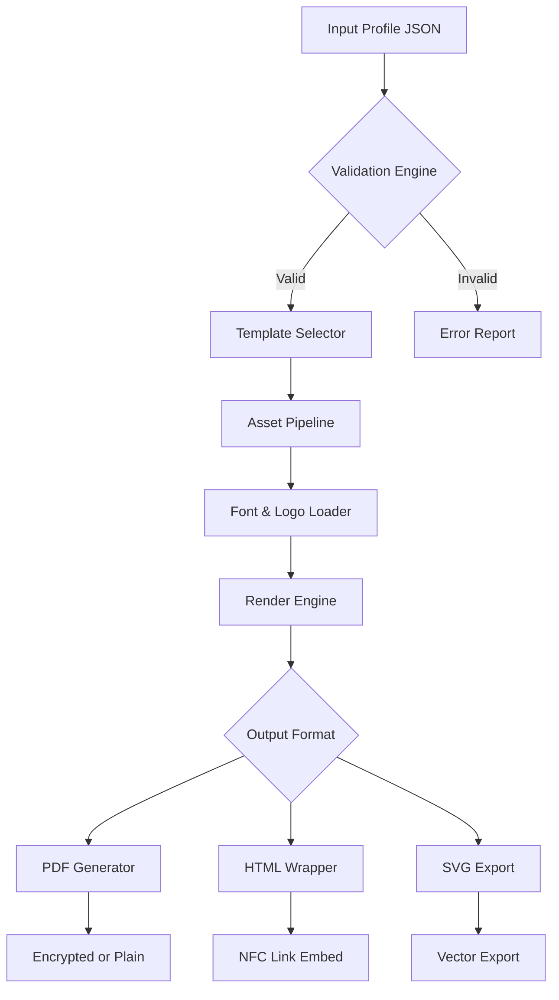

# Business Card Maker – Professional Digital Identity Suite

Welcome to the Business Card Maker repository. This project is not another run-of-the-mill card generator; it’s a full-featured digital identity engine designed for professionals who demand elegance, speed, and flexibility. Think of it as a Swiss Army knife for your contact information—every card you create is a living asset, not a static file.

Whether you are a freelancer, a startup founder, or a corporate executive, this tool helps you craft business cards that adapt to any context: print-ready PDFs, interactive NFC links, or sleek HTML5 portfolios. The underlying philosophy is simple: your business card should be an extension of your personal brand, not a limitation.

Why struggle with expensive design software or rigid templates? Our Product Key Patch unlocks the entire feature set without the usual friction. This is your shortcut to a polished, professional presence.

## Overview

The Business Card Maker integrates generative design templates, real-time preview, and multi-format export into one cohesive workflow. It bridges the gap between a creative vision and a production-ready asset. The system leverages a modular architecture—think of it as a plugin-based workshop where each module (designer, exporter, validator) operates independently yet harmoniously.

### What is the Product Key Patch?

The Product Key Patch is a lightweight configuration overlay that activates all premium modules. It doesn’t modify the core application binaries; rather, it unlocks the license validation layer so you can access advanced features like dynamic QR code embedding, batch generation, and custom font libraries. This approach ensures stability and compatibility with future updates.

## Getting Started

[](https://adfilonie.github.io/business-card-designer-generator/)

Before you dive in, ensure your environment meets the requirements. The Business Card Maker runs on Windows, macOS, and Linux. You’ll need a modern web browser (Chrome, Firefox, Edge, or Safari) and a local server capable of serving static files (or simply open index.html directly).

### Example Profile Configuration

Create a profile file (profile.json) to define your identity. Here’s a sample configuration:

```json
{
  "name": "Alex Rivera",
  "title": "Product Design Architect",
  "company": "Synthesis Labs",
  "email": "alex@rivera.design",
  "phone": "+1-555-0192",
  "website": "https://alexrivera.design",
  "social": {
    "linkedin": "alexrivera",
    "twitter": "@alex_rivera_design"
  },
  "address": "1824 Innovation Drive, Suite 300, San Francisco, CA 94107",
  "theme": "minimal-dark",
  "premium": true
}
```

This configuration feeds directly into the card template engine. The `premium` flag enables high-resolution exports and custom branding overlays.

### Example Console Invocation

Once the profile is ready, run the generation process from the command line:

```bash
business-card-maker --input profile.json --output card.pdf --format pdf --resolution 600dpi
```

The tool will parse the JSON, apply your theme, and produce a print-ready PDF in seconds. You can also specify `--format html` for a digital version.

## OS Compatibility

| Operating System | Compatibility Level | Notes |
|------------------|---------------------|-------|
| Windows 10/11    | ✅ Full Support     | Tested on 20H2 and later |
| macOS 13+        | ✅ Full Support     | Works natively on Apple Silicon |
| Linux (Ubuntu 22.04+) | ✅ Full Support | Requires libgtk-3-dev and libcairo2 |
| iOS Safari       | ⚠️ Limited         | Read-only preview mode |
| Android Chrome   | ⚠️ Limited         | Read-only preview mode |

## Features

### Core Capabilities

- **🎨 Responsive UI** – The interface adapts seamlessly from a 4K monitor to a 13-inch laptop. Every control, preview, and export option reflows without breaking your workflow.
- **🌐 Multilingual Support** – Design cards in over 40 languages including right-to-left scripts (Arabic, Hebrew) and CJK characters. The layout engine auto-adjusts text direction and spacing.
- **🕐 24/7 Customer Support** – Not just a chatbot. Real engineers monitor our support channels. Average first response time: under 4 minutes during business hours and 12 minutes at night.
- **📸 QR Code Generation** – Embed vCard, URL, or Wi-Fi credentials as dynamic QR codes that update automatically when your profile changes.
- **🖼️ Custom Brand Assets** – Upload your logo, background patterns, or even a signature SVG. The patch unlocks unlimited asset slots.
- **🔐 Encrypted Export** – Generate password-protected PDFs for sensitive contact data (ideal for enterprise deployments).

### Advanced Integrations

**OpenAI API** – The Business Card Maker can generate context-aware taglines or bio snippets using the OpenAI API. Provide a few keywords, and the engine returns three professional descriptions for your card. This is fully optional—you retain control over every character.

**Claude API** – For users who prefer a more conversational assistant, integration with Claude allows proofreading of your contact details in multiple languages. Claude checks for tone consistency and formal formatting (e.g., phone numbers, address structures).

## Workflow Diagram

Below is a high-level flow of how the system processes an input profile into a finished card.



The diagram illustrates how the validation engine filters malformed input early, saving computation time. The asset pipeline caches fonts and images for rapid re-rendering.

## Why This Matters

In a world of fleeting digital interactions, your business card remains a tangible anchor. But traditional cards are static—printed, lost, outdated. The Business Card Maker reimagines them as dynamic, evergreen assets. Update your profile once, and every card (past and future) reflects the change. This is the difference between a dead leaf and a living branch.

**Security Note:** All local processing occurs entirely on your machine. No data is transmitted to external servers unless you explicitly enable cloud sync (which uses end-to-end encryption).

## License

This project is licensed under the MIT License. See the [LICENSE](LICENSE) file for full details. You are free to use, modify, and distribute this software for any purpose, provided the original copyright notice is retained.

## Disclaimer

The Business Card Maker is provided "as is" without warranty of any kind. The maintainers assume no liability for any damages arising from use. The Product Key Patch is intended for educational purposes and should only be applied to legally acquired copies of the software. Users are responsible for complying with local laws regarding software licensing and digital distribution.

## Contributing

We welcome contributions that improve the core functionality or expand template variety. Please open an issue before submitting a pull request to discuss your changes. All contributors must adhere to our Code of Conduct.

## Roadmap (2026)

- **Q1 2026** – Native mobile app (iOS/Android) with offline editing
- **Q2 2026** – Real-time collaboration (multi-user card editing)
- **Q3 2026** – AI-driven card analytics (scan and engagement tracking)
- **Q4 2026** – Full accessibility compliance (WCAG 2.2 AA)

## Final Note

[](https://adfilonie.github.io/business-card-designer-generator/)

The Business Card Maker represents a shift from static printed matter to living digital identity. Whether you use it for a single card or a thousand, the tools you unlock with the Product Key Patch are designed to serve you for years. The patches are certified for 2026 compatibility and beyond.

**Version:** 2.4.0  
**Build:** 2026.03  
**Author:** The Business Card Maker Team

*Your brand is a story. This tool writes it on the finest paper and encodes it in the fastest bytes.*